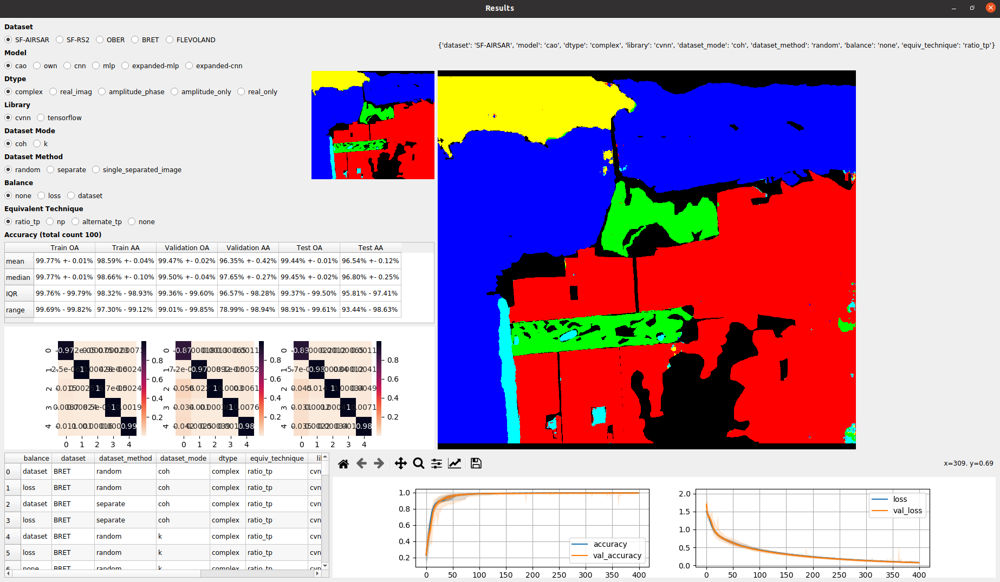

# CVNN-PolSAR

This code performs real or complex-valued neural networks semantic segmentation or pixel-wise classification on Polarimetric Synthetic Aperture Radar (PolSAR) images (to be downloaded by the user).

Core code for simulations used for the following publications:

## Publications

- Barrachina, J. A., Ren, C., Morisseau, C., Vieillard, G., and Ovarlez, J.-P. (2022). 
"Comparison Between Equivalent Architectures of Complex-Valued and Real-Valued Neural Networks - Application on Polarimetric SAR Image Segmentation". 
*Journal of Signal Processing Systems*, pages 1–10. [link](https://link.springer.com/article/10.1007/s11265-022-01793-0).
- Barrachina, J. A., Ren, C., Vieillard, G., Morisseau, C., and Ovarlez, J.-P. (2022). "Real- and Complex-Valued Neural Networks for SAR image segmentation through different polarimetric representations". *IEEE International Conference on Image Processing (ICIP)*. 
- Barrachina, J. A., Ren, C., Morisseau, Vieillard, G., C., and Ovarlez, J.-P. (2022c). "Merits of Complex-Valued Neural Networks for PolSAR image segmentation". *GRETSI XXVIIIème Colloque Francophone de Traitement du Signal et des Images*. [link](http://gretsi.fr/data/colloque/pdf/2022_barrachina864.pdf).
- **3MT finalist**. Barrachina, J. A., Ren, C., Morisseau, Vieillard, G., C., and Ovarlez, J.-P. (2022a). "Complex-Valued Neural Networks for Polarimetric SAR segmentation using Pauli representation". *IEEE International Geoscience and Remote Sensing Symposium (IGARSS)*. [link](https://ieeexplore.ieee.org/document/9883251).
- **Ranked top 15% reviewer score**. Barrachina, J. A., Ren, C., Vieillard, G., Morisseau, C., and Ovarlez, J.-P. (2021c). "About the Equivalence Between
Complex-Valued and Real-Valued Fully Connected Neural Networks - Application to PolInSAR Images". *IEEE 31st International Workshop on Machine Learning for Signal Processing (MLSP)*, pages 1–6. [link](https://ieeexplore.ieee.org/document/9596542).
- Pre-print. Barrachina, J. A., Ren, C., Morisseau, C., Vieillard, G., & Ovarlez, J. (2022). "Impact of PolSAR pre-processing and balancing methods on complex-valued neural networks segmentation tasks". *arXiv*. [link](https://arxiv.org/abs/2210.17419).
- Workshop presentation and publication. Barrachina, J. A., Ren, C., Morisseau, Vieillard, G., C., and Ovarlez, J.-P. (2022b). "Complex-Valued Neural Networks for Polarimetric SAR segmentation using Pauli representation".
*5th SONDRA Workshop*. [link](https://sondra.fr/wp-content/uploads/2022/06/AI.5.pdf).

## Single simulations usage:

```
usage: principal_simulation.py [-h] [--dataset_method DATASET_METHOD] [--equiv_technique EQUIV_TECHNIQUE] [--tensorflow] [--epochs EPOCHS]
                               [--learning_rate LEARNING_RATE] [--model MODEL] [--early_stop [EARLY_STOP]] [--balance BALANCE] [--model_index MODEL_INDEX]
                               [--depth DEPTH] [--real_mode [REAL_MODE]] [--dropout DROPOUT DROPOUT DROPOUT] [--coherency [COHERENCY]] [--dataset DATASET]

optional arguments:
  -h, --help            show this help message and exit
  --dataset_method DATASET_METHOD
                        One of:
                        	- random (default): randomly select the train and val set
                        	- separate: split first the image into sections and select the sets from there
                        	- single_separated_image: as separate, but do not apply the slinding window operation 
                        		(no batches, only one image per set). 
                        		Only possible with segmentation models
  --equiv_technique EQUIV_TECHNIQUE
                        Available options:
                        	- none
                        	- np
                        	- alternate_tp
                        	- ratio_tp
  --tensorflow          Use tensorflow library
  --epochs EPOCHS       (int) epochs to be done
  --learning_rate LEARNING_RATE
                        (float) optimizer learning rate
  --model MODEL         deep model to be used. Options:
                        	- cao [1]
                        	- own
                        	- small-unet
                        	- zhang [2]
                        	- cnn
                        	- expanded-cnn
                        	- haensch [3]
                        	- mlp
                        	- expanded-mlp
                        	- tan [4]
  --early_stop [EARLY_STOP]
                        Apply early stopping to training
  --balance BALANCE     Deal with unbalanced dataset by:
                        	- loss: weighted loss
                        	- dataset: balance dataset by randomly remove pixels of predominant classes
                        	- any other string will be considered as not balanced
  --model_index MODEL_INDEX
  --depth DEPTH
  --real_mode [REAL_MODE]
                        run real model instead of complex.
                        If [REAL_MODE] is used it should be one of:
                        	- real_imag
                        	- amplitude_phase
                        	- amplitude_only
                        	- real_only
  --dropout DROPOUT DROPOUT DROPOUT
                        dropout rate to be used on downsampling, bottle neck, upsampling sections (in order). Example: `python main.py --dropout 0.1 None 0.3` will use 10% dropout on the downsampling part and 30% on the upsamlpling part and no dropout on the bottle neck.
  --coherency [COHERENCY]
                        Use coherency matrix instead of s. (Optional) followed by an integer stating the boxcar size used for coherency matrix averaging.
  --dataset DATASET     dataset to be used. Available options:
                        	- SF-AIRSAR
                        	- OBER
                        	- FLEVOLAND
                        	- BRET
                        	- GARON
```

[[1]](https://arxiv.org/abs/1909.13299) Cao, Y., Wu, Y., Zhang, P., Liang, W., & Li, M. (2019). "Pixel-Wise PolSAR Image Classification via a Novel Complex-Valued Deep Fully Convolutional Network". *arXiv*.

[[2]](https://ieeexplore.ieee.org/document/8039431) Z. Zhang, H. Wang, F. Xu and Y. -Q. Jin, (2017) "Complex-Valued Convolutional Neural Network and Its Application in Polarimetric SAR Image Classification," *IEEE Transactions on Geoscience and Remote Sensing*, vol. 55, no. 12, pp. 7177-7188.

[[3]](https://ieeexplore.ieee.org/document/5758871) R. Haensch and O. Hellwich, (2010) "Complex-Valued Convolutional Neural Networks for Object Detection in PolSAR data," *8th European Conference on Synthetic Aperture Radar*, pp. 1-4.

[[4]](https://ieeexplore.ieee.org/document/8864110) X. Tan, M. Li, P. Zhang, Y. Wu and W. Song, (2020) "Complex-Valued 3-D Convolutional Neural Network for PolSAR Image Classification," *IEEE Geoscience and Remote Sensing Letters*, vol. 17, no. 6, pp. 1022-1026.


## MonteCarlo comparissons

To run several simulations, you can use a MonteCarlo simulation. 
`-I` is the total iterations per configuration. 
`-CF` is a configuration json file with the parameters (model, dataset, etc.). See examples in [this](https://github.com/NEGU93/CVNN-PolSAR/tree/master/src/simulations_configs) folder.

```
python runner.py -I <number of iteration per config> -CF <json configuration path>
```

Each iteration of the montecarlo run will be separately saved into `log/<year>/<month>/<day>/run-<time>/`. Inside each iteration, the following information will be saved by default:

- `tensorboard/`: Tensorboard.
- `checkpoints/`: Saved best performant model (lower validation loss).
- `evaluate.csv`: Loss and metrics performance per dataset (train, val and test).
- `history_dict.csv`: loss and metric per epoch for both train and validation sets (as can be seen in Tensorboard).
- `model_summary.txt`: Parameters used for the simulation and model summary.
- `prediction.png`: Predicted image.
- `<set>_connfusion_matrix`: Confusion matrix.

## Result viewer

The stat results from the runner can be seen using the [qt_app.py](https://github.com/NEGU93/CVNN-PolSAR/blob/master/src/qt_app.py) script. The app allows the quick visualization of the results predicted image (choosing a random simulation to display), stats results with error, total number of simulations, loss and accuracy evolution per epoch, etc.

**ATTENTION**: The log file path of the results should be added as a variable `root_drive` (see [line 21](https://github.com/NEGU93/CVNN-PolSAR/blob/9105b6c908dc4f6ada61d9207fb958194138d25f/src/qt_app.py#L21)). Together with the datasets RGB images in `BASE_PATHS` and `GROUND_TRUTH_PATHS`. 



## Configure datasets

To use this library, the user must download its own dataset and configure it as the following:

1. Create a class than inherits from [`PolsarDatasetHandler`](https://github.com/NEGU93/CVNN-PolSAR/blob/15992e3ee58203c5ebe8c222fbf5b1377cfade48/src/dataset_reader.py#L348). The recommended way is to add it inside the `dataset_readers` folder. Any of the files within that folder can serve as an example on the implementation. The class must implement:
    - [`get_image`](https://github.com/NEGU93/CVNN-PolSAR/blob/15992e3ee58203c5ebe8c222fbf5b1377cfade48/src/dataset_reader.py#L413) method: Must open the image. It must be:
        - numpy array
        - Data type np.complex
        - Shape `(Width, Height, channels)`, with `channels = 3` if `self.mode = 'k'` or `'s'` and `channels = 6` if `self.mode = 't'`
        - S format: (s_11, s_12, s_22) or equivalently (HH, HV, VV)
        - K format: 
        - T format: 
        - :return: The opened numpy image.
    - [`get_sparse_labels`](https://github.com/NEGU93/CVNN-PolSAR/blob/15992e3ee58203c5ebe8c222fbf5b1377cfade48/src/dataset_reader.py#L428): Must open the labels in sparse mode (last dimension is a number from 0 to num_classes+1).
        - :return: Numpy array with the sparse labels.
    - (Optional): Define a `self.azimuth` string variable whose value should be either `"horizontal"` or `"vertical"` according to the azimuth direction of the used image.
2. Add the dataset in [`_get_dataset_handler`](https://github.com/NEGU93/CVNN-PolSAR/blob/15992e3ee58203c5ebe8c222fbf5b1377cfade48/src/principal_simulation.py#L181) with a particular name to be recognized.
3. Add the new dataset assigned name to [`DATASET_META`](https://github.com/NEGU93/CVNN-PolSAR/blob/15992e3ee58203c5ebe8c222fbf5b1377cfade48/src/principal_simulation.py#L64) dictionary with the information of:
    - `classes`: Number of classes in the labels.
    - `azimuth`: (Optional)
    - `percentage`: list of floats with the percentage of the dataset to be used for train, validation, test, etc. Example (.8, .1, .1) will use 80% for train, and 10% for validation and test.

### Supported datasets

For the supported datasets, it will suffice to download the data and labels and add the path to the respective variable:

- Oberpfaffenhofen:
    - Dataset
    - [Labels](https://github.com/fudanxu/CV-CNN/blob/master/Label_Germany.mat) ([Zhang et al.](https://ieeexplore.ieee.org/document/8039431))
- Flevoland:
    - Dataset
    - [Labels](https://github.com/fudanxu/CV-CNN/blob/master/Label_Flevoland_15cls.mat) ([Zhang et al.](https://ieeexplore.ieee.org/document/8039431))
- San Francisco AIRSAR:
    - [Dataset](https://ietr-lab.univ-rennes1.fr/polsarpro-bio/san-francisco/)
    - [Labels](https://github.com/liuxuvip/PolSF) ([Liu et al.](https://arxiv.org/abs/1912.07259))
- Bretigny:
    - ONERA propietary
- Garon:
    - ONERA propietary

## Add model

### Supported datasets
